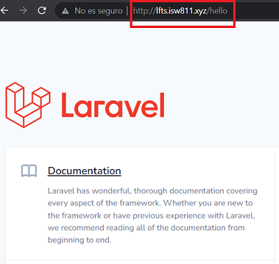

# **Create a Blog with Laravel 8**
El objetivo de este curso es desarrollar un blog para empresa o personal a través del Framework Laravel. 

# **Section 2: THE BASICS**

## **05- How a Route Loads a view**
- En Laravel en el archivo  `routes/web.php` se configuran todas las rutas de aplicación, tal como se muestra:

```php
Route::get('/', function () {
    return view('welcome');
});
```

- De esta forma se accede a la vista de la página de bienvenida realizando un simple GET, sin embargo se puede crear 
una ruta más específica o Endpoint, de la siguiente manera:


Así al momento de tratar de visualizarlo en el navegador se debe consultar a esa ruta específicamente.

Sin el endpoint `/hello` nos mostrará un error, porque ya no es la dirección correcta a mostrar :


Con el endpoint `/hello`:



- Por otro lado, al definir una ruta se puede retornar lo que se desee ya sea una vista, un texto o JSON etc.

Ejemplo: Retornando un texto


## **06- Include CSS and Javascript**

- Vamos a crear una nueva vista principal nos ubicamos en `resources/views/welcome.blade.php`
y sustituimos el código existente.
```html
<!DOCTYPE html>
<html lang="en">
<head>
    <meta charset="UTF-8">
    <meta name="viewport" content="width=device-width, initial-scale=1.0">
    <title>My Blog</title>
</head>
<body>
    <h1>Hello World!</h1>
</body>
</html>
```
- Agregamos CSS y algunas funcionalidades con Javascript, nos ubicamos en el
directorio `/public` y creamos un archivo `app.css` y otro `app.js`

El código en el `CSS` es:
```css
body {
    background: navy;
    color: white;
}
```

Y en el `JS`:
```javascript
alert('I am here');
```

- Posteriormente hacemos referencia en la vista quedando de la siguiente forma:
```html
<!DOCTYPE html>
<html lang="en">
<head>
    <meta charset="UTF-8">
    <meta name="viewport" content="width=device-width, initial-scale=1.0">
    <title>My Blog</title>
    <script src="/app.js"></script>
    <link rel="stylesheet" href="/app.css">
</head>
<body>
    <h1>Hello World!</h1>
</body>
</html>
```

- Finalmente si recargamos la vista en el navegador deberia mostrarse de la siguiente manera.


## **07- Make a Route and Link to it**
Como se describió previamente podemos definir diferentes rutas para la aplicación, para
ejemplificarlo haremos cambios en nuestros archivos.

- Nos ubicamos en el directorio `routes/web.php` y renombramos el endpoint quedando:
```php
Route::get('/', function () {
    return view('posts');
});
```
- Habiendo modificado y si recargamos en el navegador obtendremos error, ya que la vista existe con el nombre
`"welcome.blade.php"` en el directorio `resourses/views`, nos dirigimos ahí y la modificamos por `"posts.blade.php"`.

- Seguidamente vamos a simular que en la página del Blog se van a realizar "publicaciones", lo vamos hacer
modificando el archivo de la vista de la siguiente manera:
```html
<!DOCTYPE html>
<html lang="en">
<head>
    <meta charset="UTF-8">
    <meta name="viewport" content="width=device-width, initial-scale=1.0">
    <title>My Blog</title>
    <link rel="stylesheet" href="/app.css">
</head>
<body>
    <article>
        <h1>My First Post</h1>
        <p>Lorem ipsum dolor sit, amet consectetur adipisicing elit. Veritatis atque nesciunt eaque eos aperiam, iusto et suscipit, culpa obcaecati perferendis aliquid! Minus, fuga quas. Corporis laboriosam nisi doloribus quos tenetur.</p>
    </article>
    <article>
        <h1>My Second Post</h1>
        <p>Lorem ipsum dolor sit, amet consectetur adipisicing elit. Veritatis atque nesciunt eaque eos aperiam, iusto et suscipit, culpa obcaecati perferendis aliquid! Minus, fuga quas. Corporis laboriosam nisi doloribus quos tenetur.</p>
    </article>
    <article>
        <h1>My Third Post</h1>
        <p>Lorem ipsum dolor sit, amet consectetur adipisicing elit. Veritatis atque nesciunt eaque eos aperiam, iusto et suscipit, culpa obcaecati perferendis aliquid! Minus, fuga quas. Corporis laboriosam nisi doloribus quos tenetur.</p>
    </article>
</body>
</html>
```


Para implementar el uso de rutas vamos a simular que al instante de realizar un click sobre cada título de las publicaciones lo redirija a una nueva página que tiene una ruta con la información de la publicación seleccionada.

- Antes nos dirigimos a `routes/web.php` y agregamos la nueva ruta a utilizar.
```php
Route::get('post', function () {
    return view('post');
});
```

- Luego debemos modificar el título de cada publicación y agregar una referencia que apuntará a la ruta dada.
```html
<!DOCTYPE html>
<html lang="en">
<head>
    <meta charset="UTF-8">
    <meta name="viewport" content="width=device-width, initial-scale=1.0">
    <title>My Blog</title>
    <link rel="stylesheet" href="/app.css">
</head>
<body>
    <article>
        <h1><a href="/post">My First Post</a></h1>
        <p>Lorem ipsum dolor sit, amet consectetur adipisicing elit. Veritatis atque nesciunt eaque eos aperiam, iusto et suscipit, culpa obcaecati perferendis aliquid! Minus, fuga quas. Corporis laboriosam nisi doloribus quos tenetur.</p>
    </article>
    <article>
        <h1><a href="/post">My Second Post</a></h1>
        <p>Lorem ipsum dolor sit, amet consectetur adipisicing elit. Veritatis atque nesciunt eaque eos aperiam, iusto et suscipit, culpa obcaecati perferendis aliquid! Minus, fuga quas. Corporis laboriosam nisi doloribus quos tenetur.</p>
    </article>
    <article>
        <h1><a href="/post">My Third Post</a></h1>
        <p>Lorem ipsum dolor sit, amet consectetur adipisicing elit. Veritatis atque nesciunt eaque eos aperiam, iusto et suscipit, culpa obcaecati perferendis aliquid! Minus, fuga quas. Corporis laboriosam nisi doloribus quos tenetur.</p>
    </article>
</body>
</html>
```
- Ahora si realizamos "click" sobre cada título nos muestra error porque no existe una vista para las publicaciones, entonces nos dirigimos a `resources/views` y creamos el archivo `post.blade.php` que contiene lo siguiente:
```html
<!DOCTYPE html>
<html lang="en">
<head>
    <meta charset="UTF-8">
    <meta name="viewport" content="width=device-width, initial-scale=1.0">
    <title>My Blog</title>
    <link rel="stylesheet" href="/app.css">
</head>
<body>
    <article>
        <h1><a href="/post">My First Post</a></h1>
        <p>Lorem ipsum dolor sit, amet consectetur adipisicing elit. Veritatis atque nesciunt eaque eos aperiam, iusto et suscipit, culpa obcaecati perferendis aliquid! Minus, fuga quas. Corporis laboriosam nisi doloribus quos tenetur.</p>
    </article>
    <a href="/">GO BACK</a>
</body>
</html>
```
De esta forma implementamos el uso de nuevas rutas en la aplicación.

## **08- Store a Blog Posts as HTML Files**

En el paso anterior al dar click en cada título de publicación (cualquier publicacón), nos redirijía a una nueva vista que contiene
la información completa, pero esta solo mostraba la de la primera publicación. Vamos a corregir de la siguiente manera:

- Nos movemos al directorio `resources/views/post.blade.php` y agregamos una variable `post` que refiere al tìtulo de cada publicación en el blog

```html
<!DOCTYPE html>
<html lang="en">
<head>
    <meta charset="UTF-8">
    <meta name="viewport" content="width=device-width, initial-scale=1.0">
    <title>My Blog</title>
    <link rel="stylesheet" href="/app.css">
</head>
<body>
    <article>
        <?= $post; ?>
    </article>

    <a href="/">GO BACK</a>
</body>

```
- Para mostrar la información única de cada post vamos a crear una vista para cada uno de ellos, nos dirigimos a `/resources` y creamos
un directorio `posts` y dentro de el creamos un archivo html con la información de cada publicación.


- Para que el direccionamiento funcione tenemos que modificar la ruta que creamos previamente, nos movemos `/routes/web.php` y modificamos
la ruta 'post' de la siguiente manera:

```php
Route::get('post/{post}', function ($slug) {

    $path=__DIR__ . "/../resources/posts/{$slug}.html";
    
    if (!file_exists($path)) {
        return redirect('/');
    }

    $post=file_get_contents($path);

    return view('post',[
        'post' =>  $post
    ]);
});
```
- De igual forma tenemos que modificar las referencias de cada tìtulo para que apunte a la vista correcta de cada publicacón,
nos movemos `resources/views/posts.blade.php`, quedando de la siguiente manera:


De esta forma si se hace click sobre alguno de los tìtulos de las publicaciones nos llevará a su respectiva información.

## **09- Route Wildcard Constraints**

 Se puede agregar restricciones a las rutas con el objetivo de que sean de más fácil uso o mejor seguridad.

 - Nos ubicamos en `routes/web.php` y agregamos una sentencia 'where' al final de la ruta `posts`.


Con esto permitimos solo el uso de letras mayúsculas, minusculas y algunos carácteres especiales.

## **10- Use Coaching for Expensive Operations**

Para optimizar y reducir la cantidad de veces de consulta de información se podría guardar en la caché de la aplicación esto
para que la próxima vez que se realice, ya tenga los datos a mano y no tenga que volver a buscarlos.

- Nos ubicamos en `routes/web.php` y modificamos la ruta `posts` , de la siguiente forma:


Con ello eventualemente será más productivo las consultas y la utilización de bases de datos.


## **- Use the Filesystem Class To Read a Directory**
## **- Find a Composer Package for Post Metadata**
## **- Collection Sorting and Caching Refresher**
#

# **Section 3: BLADE**

## **- Blade: The Absolute Basics**
## **- Blade Layouts Two Ways**
## **- A few Tweaks and Consideration**
#

# **Section 4: WORKING WITH DATABASE**

## **- Enviroment Files and Databases Connections**
## **- Migrations: The Absolute Basics**
## **- Eloquent and the Active Record Pattern**
## **- Make a Post Model and Migration**
## **- Eloquent Updates and HTML Escaping**
## **- 3 Ways to Mitigate Mass Assigment Vulnerabities**
## **- Route Model Binding**
## **- Your first Eloquent Relationship**
## **- Show All Posts Associated With a Category**
## **- Clockwork, and the N+1 Problem**
## **- Database Seeding Saves Time**
## **- Turbo Boost With Factories**
## **- View All Posts By An Author**
## **- Eager Load Realtionships on an Existing Model**
#

# **Section 5: INTEGRATE THE DESIGN**

## **- Convert the HTML and CSS to Blade**
## **- Blade Components and CSS Grids**
## **- Convert the Blog Post Page**
## **- A Small JavaScript Dropdown Detour**
## **- How to Extract a Dropdown Blade Component**
## **- Quick Tweaks and Clean-Up**
